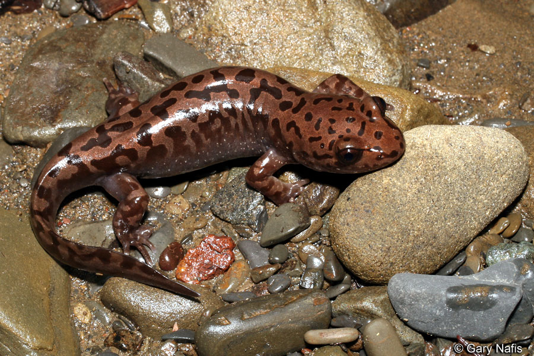
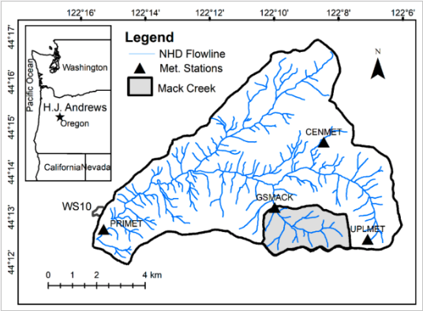

```{r setup, include=FALSE}
knitr::opts_chunk$set(echo = FALSE, message = FALSE, warning = FALSE)

library(tidyverse)
library(janitor) # for clean names function
library(directlabels) # for direct labels on line graph
library(kableExtra) # to create table
library(effsize)
library(ggbeeswarm)
library(car)

#original dataframe
mack_creek_vertebrates_og <- read_csv("mack_creek_vertebrates.csv") %>% 
  clean_names()

#pacific salamander only DF
pacific_salamander <- mack_creek_vertebrates_og %>% 
  filter(species == "DITE") %>% 
  mutate(forest_type = case_when(section == "CC" ~ "Clear cut",
                                 section == "OG" ~ "Old growth" )) %>%
  mutate(channel_type = case_when(unittype == "C" ~ "Cascade",
                                  unittype == "P" ~ "Pool",
                                  unittype == "SC" ~ "Side channel"))
  
  

```


<br>

### Introduction

When considering take of natural resources, it is important to consider the effects this take can have on its associated ecosystem. Studies have shown that clear cutting for logging operations can have both positive and negative impacts on the habitat and the species that live there, and these impacts can change with time (Murphy 1981).  The HJ Andrews Experimental Forest is a long term ecological research (lter) site located in Oregon that has two sections of forest, a clear cut section (ca. 1963) and a 500 year old coniferous forest, that allows researchers to explore this question over space and time. Here we look at the Pacific giant salamander (*Dicamptodon tenebrosus*) (Figure 1.), an inhabitant of this area, and a species whose larval stage was shown to be negatively affected by logging (Corn 1989).  Using the HJ Andrews Experimental Forest lter survey data, we investigate if there is a relationship to the type of forest (clear cut or old growth) the Pacific giant salamanders reside in, to their abundance, weight and channel preference.




###### ***Figure 1.*** *Pacific giant salamander(Dicamptodon tenebrosus). Photo credit: Gary Nafis.*

<br>


### Data and Methods

Data on Pacific giant salamanders was collected from 1993 - 2017 in Mack Creek of H.J Andrews Experimental Forest, Oregon (Figure 2.). Samples were collected in forests that were subjected to clearcutting in 1963 (clear cut) or in a 500 year old coniferous forest (old growth). Salamanders were collected via electrofishing in different channels (pools, cascades, or side - channels) and weighed to the nearest 0.01 grams. For more detailed information, refer to the [metadata](https://portal.lternet.edu/nis/mapbrowse?packageid=knb-lter-and.4027.12) (Gregory S. V. 2016). We compared salamander abundances in 2017 between channel types in clear cut and growth forests using a chi-squared test. Mean salamander weights between clear cut and old growth forests were compared with a Welch two-sample t-test (α = 0.05). In addition, we used an ANOVA with post-hoc Tukey HSD to compare mean salamander weights between channel types. All analyses and figures were prepared using R software version 3.6.1. 

<br>



###### ***Figure 2.*** *Map of the H.J Andrews Experimental Forest, Oregon. Location of Mack Creek is shaded in gray.  (Mosquera, Segura, & Crespo, 2018)*

<br>

### Results

#### A: Changes in annual salamander abundance in old growth and clear cut sections of Mack Creek.
Abundance in pacific salamanders has increased overall in both clear cut and old growth forests from 1993 to 2017, rising by 198% and 154% respectively. The two salamander populations appear to follow a similar pattern of incline and decline in population abundance throughout the study. The salamanders in old growth forests generally had higher counts compared to those in clear cut forests, until 2014 (Figure 3.).

```{r, fig.cap= "***Figure 3.*** *Annual pacific salamander counts in old growth and clear cut sections of Mack Creek (1993 - 2017).*"}

#H ere we explore pacific salamander abundances between clear cut and old growth forests between 1993 and 2017

# pacific salamander counts df 1993-2017
pacific_salamander_count <- pacific_salamander %>% 
  count(year, forest_type, name = "count")

# plot 
years_growth_plot <- ggplot(pacific_salamander_count, aes(x = year, y = count)) +
  geom_line(aes(color = forest_type)) +
  geom_point(aes(color = forest_type)) +
  scale_x_continuous(limits = c(1993, 2017), expand = c(0,0.5), breaks = seq(0, 2017, 5)) +
  scale_y_continuous(limits = c(0, 400), expand = c(0,0), breaks = seq(0, 380, 50)) +
  scale_color_manual(values = c("green", "forestgreen"), labels = c("Clear cut", "Old growth")) +
  labs(x = "Year",
       y = "Abundance",
       color = "Forest type")+
  theme_minimal()

years_growth_plot


# we can see that they are generally the same trend, many of the years clear cut is less, but overall trending in numbers other than that steep decline

```

<br>

#### B: Abundance of Pacific giant salamanders across channel and forest type in 2017


```{r, include = FALSE}

#Here we explore the abundances of salamanders per channel type and forest type. 

# ps is for pacific salamander. creates dataframe with only information for 2017 salamanders
ps_2017_channel_count <- pacific_salamander %>% 
  filter(year == "2017") %>% 
  count(channel_type, forest_type, name = "count") %>% 
  na.omit()

# create table with counts
ps_2017_channel_table <- ps_2017_channel_count %>% 
  pivot_wider(names_from = channel_type, values_from = count) 

# create a table with counts and proportions of salamanders found in each channel type of the total amount found in each forest type
ps_2017_channel_props <- ps_2017_channel_table %>% 
  adorn_percentages(denominator = "row") %>% 
  adorn_pct_formatting(digits = 1) %>% #percentages go to one decimal point
  adorn_ns(position = "front") %>% #add the n value before the percent
  kable(col.names = c("Forest type", "Cascade", "Pool", "Side-channel"),
        caption = "***Table 1.*** *Counts of pacific salamanders in clear cut and old growth forests across channel types in 2017. Percentages of salamanders found in each channel type (cascade, pool, side-channel) are expressed in relation to the total number of salamanders found in each forest type (clear cut, old growth).*") %>% #rename the channel types
  kable_styling() %>% 
  add_header_above(c("Channel type " = 4))

ps_2017_channel_props
```


```{r, include = FALSE}
# Make this a contingency table that **only contains the actual counts** to perform chi sqaure

chi_ps_2017_channel_count <- ps_2017_channel_table %>% 
  select(-forest_type)

chi_ps_2017_channel_count

chi_test_ps_2017_channel <- chisq.test(chi_ps_2017_channel_count)
chi_test_ps_2017_channel

```

There is no significant effect of forest type (clear cut/old growth) on where in the channel (cascade/pool/side-channel) pacific salamanders are found ($\chi$^2^(`r chi_test_ps_2017_channel$parameter`) = `r round(chi_test_ps_2017_channel$statistic,2)`, *p* = `r round(chi_test_ps_2017_channel$p.value, 2)`). The percentage of salamanders found in cascades and side-channels differed by less than 5% between clear cut and old growth forests. Percentages of salamanders found in pools differed slightly more, but still by less than 10%. (*Table 1.*)

```{r}
ps_2017_channel_props

# running table here to show up after text
```

<br>

#### C: Mean weights of Pacific giant salamanders between forest types in 2017

```{r, include = FALSE}

# Creates a dataframe with only 2017 salamander data with forest type, channel type, and weights
ps_2017_weight <- pacific_salamander %>% 
  filter(year == "2017") %>% 
  select(year, forest_type, channel_type, weight)

#exploratory data viz

ggplot(ps_2017_weight, aes(x = weight)) +
  geom_histogram(aes(fill = forest_type))

#even though we see outliers and the distribution are not normal, bc we have such high sample sizes we can use the central limit theorem


```

```{r, include = FALSE}
#we would like compare mean salamander weight in 2017 in clear cut and old growth forests. we first create data fromes for weights in each forest in 2017 only. 

#clear cut 2017 weights dataframe
cc_weight <- ps_2017_weight %>% 
  filter(forest_type == "Clear cut")

#old growth 2017 weights data frame
og_weight <- ps_2017_weight %>% 
  filter(forest_type == "Old growth")

#running a t-test and effect size to statisically evaluate the difference in weights
ps_weight_ttest <- t.test(cc_weight$weight, og_weight$weight)
ps_weight_ttest
# t = 1.6669, df = 692.79, p-value = 0.09599, mean of x= 7.77, mean of y = 6.58, not a significant difference using a CI of 5%

#effect size
ps_weight_eff <- cohen.d(cc_weight$weight, og_weight$weight, na.rm = TRUE)
ps_weight_eff
#effect size is negligible

# there is not a sig diff between mean salamnder weights in 2017 between clear cut and old growth 

```
Weights were compared of pacific giant salamanders in old growth forests to those in clear cut forests in 2017 only. There was not a significant difference in weights of salamanders between the two forest types (Welch Two Sample t-test, t = `r round(ps_weight_ttest$statistic,2)`, df = `r round(ps_weight_ttest$parameter,2)`, p = `r round (ps_weight_ttest$p.value,3)`). Mean weights differed by 16.7%, with a negligible effect size (Cohen's d = (`r round(ps_weight_eff$estimate,2)`)).  


<br>

#### D: Mean weights of Pacific giant salamander by channel type in 2017. 
```{r, include=FALSE}
#visual exploration

#-----------------------weight by channel type 2017 DF-----------------------------------#
ps_2017_channel_weight <- ps_2017_weight %>% 
  select(year, channel_type, weight) %>% 
  na.omit()
#--------------------------------------------------------------------------------------# 


#----------------------------exploratory histogram----------------------------------#
ggplot(ps_2017_channel_weight, aes(x = weight)) +
  geom_histogram(aes(fill = channel_type)) +
  facet_wrap(~channel_type, scales = "free")

# here we see positively skewed data, outliers, while means could be used due to CLT, it would not be the most appropriate representation of central tendency
#-------------------------------------------------------------------------------# 


#----------------------------exploratory qq plot----------------------------------#
ggplot(ps_2017_channel_weight, aes(sample = weight)) +
  geom_qq() +
  facet_wrap(~channel_type, scales = "free")
#
#-------------------------------------------------------------------------------# 

 

```


```{r, include = FALSE}
# A summary DF for each of the channel types to be used for plotting  
ps_2017_channel_summary <- ps_2017_channel_weight %>% 
  group_by(channel_type) %>% 
  summarise(
    sample_size = n(),
    mean_weight = mean(weight),
    sd_weight = sd(weight),
    se_weight = sd(weight)/ sqrt(n()),
    var_weight = var(weight)
    )
ps_2017_channel_summary

#largest variance is 185.58, smallest variance is 68.31, largest is less than 4x, variances are likely close enough

```


```{r, fig.cap= "***Figure 4.*** *Pacific giant salamander weights across channel types ( side-channel, pool, cascade). Mean salamander weights per channel type are depicted by black dots with error-bars representing standard error.*"}

#Creates a beeswarm plot that shows the data spread and shape to visualize salamander weights across the 3 channel types

ps_2017_channel_plot <- ggplot() +
  geom_beeswarm(data = ps_2017_channel_weight, aes(x = channel_type, y = weight, color = channel_type), size = 1, alpha = 0.6) +
  scale_color_manual(values = c( "#3fc5f0","#4d80e4","#333399")) +
  scale_y_continuous(limits = c(0, 105), expand = c(0,0), breaks = seq(0, 100, 25))+
  theme_minimal()+
  geom_point(data = ps_2017_channel_summary, aes(x = channel_type, y = mean_weight), size = 0.8)+
  geom_errorbar(data = ps_2017_channel_summary, aes(x = channel_type,
                                                    ymin = mean_weight - se_weight,
                                                    ymax = mean_weight + se_weight),
                width = 0.1)+
  theme(legend.position = "none") +
  theme(axis.title.y = element_blank())+
  labs(y = "Pacific salamander weight (g)")+
  coord_flip()

ps_2017_channel_plot


```


```{r, include = FALSE}
#Statistical analysis of weights between the three channel types:


#----------------------------Levene's test------------------------------------# 
#(hypothesis test for equal variance) for the weights of three channel types:

leveneTest(weight ~ channel_type, data = ps_2017_channel_weight)

#H0: variances are equals, there is no difference in variance 
#HA: variances are not equal, there is a difference in variance

# given that p greater than 0.05, we retain the null that variances are equal or not sig different, so we can proceed with an anova which has the assumption that variances are equal. We expected this since we saw that the largest was less than 4x in the summary table df we created. 
#-------------------------------------------------------------------------------# 


#----------------------------ANOVA----------------------------------------------#
ps_aov <- aov(weight ~ channel_type, data = ps_2017_channel_weight)
summary(ps_aov) # p = 0.0151, F = 4.216, DF = 2
# There is a significant difference in groups, so move forward with tukeys post hoc analysis to determine which pairwise combinations are significantly different
#-------------------------------------------------------------------------------# 


#--------------------------Post-hoc analysis------------------------------------# 
ps_tukey <- TukeyHSD(ps_aov)
#       pool-cascade, p = 0.286
# sidechannel-cascade, p = 0.084
# sidechannel - pool, p = 0.016****
#pstukey$channel_type

# only significant difference is between the ***side channel and the pool***
#-------------------------------------------------------------------------------# 


#-------------------------ANOVA summary----------------------------------------# 
ps_aov_outputs <- unlist(summary(ps_aov))
ps_aov_outputs #This creates a summary of all the outputs from our ANOVA so we can reference it

# The first item [1] is the numerator degrees of freedom; 
# The second item [2] is the denominator degrees of freedom; 
# The seventh item [7] is the F-statistic value;
# The ninth item [9] is the p-value
#-------------------------------------------------------------------------------# 

```

```{r, include = FALSE}
# Now we want to do effect sizes on each of the populations regardless of their significant differences

#----------------------------Channel DF's------------------------------------------
#Here we will split them each into different dataframes so that we are able to use the dateframe for effsize test

cascade_weight <- ps_2017_channel_weight %>%  
  filter(channel_type == "Cascade")

pool_weight <- ps_2017_channel_weight %>%
  filter(channel_type == "Pool")

side_channel_weight <- ps_2017_channel_weight %>%
  filter(channel_type == "Side channel")
#--------------------------------------------------------------------------------


#-------------------------------Effect size---------------------------------------
#Here we will test the effect sizes of each channel type interactions

#cascade salamander weights - pool salamander weights
cascade_pool_ef <- effsize::cohen.d(cascade_weight$weight, pool_weight$weight)
cascade_pool_ef
#Effect size is negligible, which is not surprising because the difference was insignificant in our Tukey's HSD


#Eside_channel salamander weights -cascade salamander weights
cascade_side_channel_ef <- effsize::cohen.d(cascade_weight$weight, side_channel_weight$weight)
cascade_side_channel_ef
#Effect size is small


#side_channel salamander weights - pool salamander weights
pool_side_channel_ef <- effsize::cohen.d(pool_weight$weight, side_channel_weight$weight)
pool_side_channel_ef
#Effect size is small

#-------------------------------------------------------------------------------# 
```

<br>

A significant difference was detected in mean salamander weights (g) by channel type (one-way ANOVA, F(`r ps_aov_outputs[1]`, `r ps_aov_outputs[2]`) = `r round(ps_aov_outputs[7],2)`, *p* = `r round(ps_aov_outputs[9],3)`). A post-hoc analysis was performed using Tukey's HSD and a signifiant difference was detected  between side-channel and pool (*p* = `r round(ps_tukey$channel_type[3,4],3)`), differing by around 48% with a small effect size (Cohen's d = (`r round(pool_side_channel_ef$estimate,2)`)). There was not a significant difference detected between the other pairwise combinations.

While comparisons of means was used for analysis, it is important to note that this might not be the best method for analysis, as a visual investigation indicates that the data contains many outliers and is heavily skewed (Figure 4.). For further investigation, it might be a better option to make comparisons using median values, a measure of central tendency that will not be biased by skew and outliers. 

<br>

#### Summary 
- From 1993 - 2017, Pacific giant salamander abundances between clear cut and old growth forests followed similar trends, but overall were less in clear cut forests. (Figure 3.)

- Abundances of salamanders in cascades, pools, and side - channels were not significantly effected by the forest type they were found in (clear cut or old growth). (Table 1.)

- Average salamander weights did not significantly differ between forest types.(Results C.)

- Average salamander weights differed significantly between side-channels and pools.(Figure 4.) 

<br>

#### References 

**Corn, P. S. and Bury, R. B. (1989).** ''Logging in Western Oregon: responses of headwater habitats and stream amphibians.'' Forest Ecology and Management, 29, 39-57.

**Gregory S. V. (2016).** Aquatic Vertebrate Population Study in Mack Creek, Andrews Experimental Forest, 1987 to present. Environmental Data Initiative. https://doi.org/10.6073/pasta/5de64af9c11579266ef20da2ff32f702. Dataset accessed 11/19/2019.

**Mosquera, G. M., Segura, C., & Crespo, P. (2018).** Flow partitioning modelling using high-resolution isotopic and electrical conductivity data. Water (Switzerland), 10(7), 1–23. https://doi.org/10.3390/w10070904

**Murphy, M. L. and Hall, J. D. (1981).** ''Varied effects of clear cut logging on predators and their habitat in small streams of the Cascade Mountains, Oregon.'' Canadian Journal of Fisheries and Aquatic Science, 38, 137-145.


TO DO:

- Continue annotating
- review grading rubric to make sure we included everything


